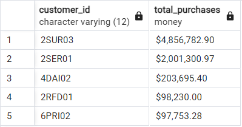
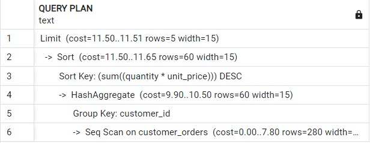
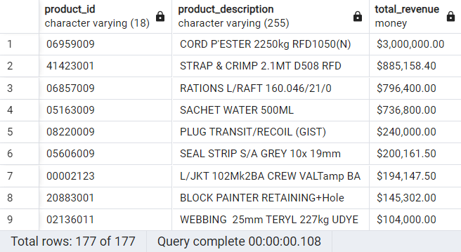

# Steps From Scratch
All the steps taken since the start of this task are documented here.

## Create Folder Structure

``` markdown
Task1_SQL/
├── sql_queries/
│   ├── subtask1_query.sql
│   └── subtaskN_query.sql
│
├── data/
│   └── customer_dataset.csv
│
├── documentation/
│   └── README.md
│   └── SETUP.md
``` 

- **SQL_Queries Subdirectory:** Folder to contain all queries related to Task1.
- **Data Subdirectory:** Folder to contain all data related to Task1.
- **Documentation Subdirectory:** Folder to contain all docs related to Task1.
- **README.md File:** File to document all steps taken to complete Task1.
- **SETUP.md File:** File to document setup instructions for testers/contributors to Task1.

## Import Customer Dataset to PostgreSQL

- Open pgAdmin, connect to your PostgreSQL server, and create a database ```customers```.
- Go to the Query Tool of this db and create a table according to the CSV's schema by the SQL query:

```sql
CREATE TABLE customer_orders ( -- creating table according to the CSV columns
    customer_id VARCHAR(12), -- VARCHAR is used for all alphanumeric columns
    customer_name VARCHAR(100),
    order_id VARCHAR(12),
    order_date DATE, -- DATE used for both date columns
    shipment_date DATE,
    product_id VARCHAR(18),
    product_description VARCHAR(255),
    quantity INTEGER,
    unit_price MONEY -- MONEY used for unit_price column, with the default currency set to $ (can be changed if needed)
);
```

- Import the Task1_SQL/data/customer_dataset.csv file by the following query in the Query Tool:

```sql
SET datestyle TO iso, dmy; -- default postgreSQL datestyle is ymd, adjusting it according to the CSV file

COPY customer_orders ( -- copying CSV file contents; **MUST** change the path according to your PC when testing
    customer_id,
    customer_name,
    order_id,
    order_date,
    shipment_date,
    product_id,
    product_description,
    quantity,
    unit_price
)
FROM 'C:/Users/ahsan/Downloads/data-eng-tasks/Task1_SQL/data/customer_dataset.csv'
DELIMITER ',' -- specifying delimiter used in CSV file
CSV HEADER; -- ensuring the first column is skipped as it is the header
```

## Sub-Task 1: Query Optimization

### Create the Query

- In the Query Tool, run the following query to get top 5 paying customers in descending order:

```sql
-- Select top 5 customers with highest total purchases in descending order
SELECT
    customer_id,
    SUM(quantity * unit_price) AS total_purchases -- total purchases calculated
FROM
    customer_orders
GROUP BY
    customer_id
ORDER BY
    total_purchases DESC -- sorted in descending order
LIMIT 5; -- showing only top 5 customers
```



### Optimize the Query 

- To further optimize this query, we check its Query Plan by using the following query:

```sql
EXPLAIN
SELECT
    customer_id,
    SUM(quantity * unit_price) AS total_purchases
FROM
    customer_orders
GROUP BY
    customer_id
ORDER BY
    total_purchases DESC
LIMIT 5;
```



Since our dataset is small, the costs occurring are nominal. 

Considering the possibility of this dataset (customer orders) growinng over time, we have two options: 
- Using Materialized Views (MVs):
    - The nature of our dataset is that it would be changing continuously as new orders come, making MVs expensive to refresh.
    - The MV is specific to this query, and does not help in any other queries.
- Indexing:
    - Indexing requires an overhead with each write operation, which is better compared to MVs' expense.
    - The indexing would increase efficiency in other queries as well, that use the indexed columns.

As optimization is required in the case of a larger dataset, we should consider the proportional increase in costs for the Seq Scan required for the GROUP BY clause. Thus, we index the customer_id by query:

```sql
-- Creating an index on the customer_id column to optimize grouping
CREATE INDEX idx_customer_id ON customer_orders(customer_id);
```

## Sub-Task 2: Data Transformation

- In the Query Tool, run the following query to get total revenue of each product in descending order:

```sql
-- Calculate the total revenue for each product in descending order
SELECT
    product_id,
    product_description,
    SUM(quantity * unit_price) AS total_revenue -- total revenue calculated
FROM
    customer_orders
GROUP BY
    product_id, product_description
ORDER BY
    total_revenue DESC; -- sorted in descending order by total revenue
```

