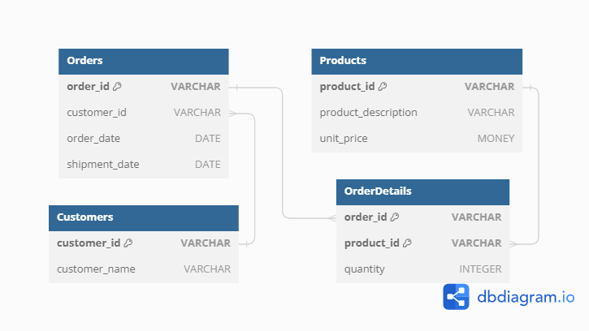

# Testing Instructions

Follow these steps to set up and test the SQL tasks:

## Prerequisites

- PostgreSQL installed on your machine. You can download it [here](https://www.postgresql.org/download/).
- Git installed on your machine. You can download it [here](https://git-scm.com/downloads).

## Task 1: Query Optimization

1. Clone the repository (if not done yet), and switch to Task1 folder:
   ```bash
   git clone "https://github.com/Me-AU/data-eng-tasks"
   cd Task1_SQL
   ```

2. Import the dataset:
    - *Follow the steps in [this heading of README.md](README.md#import-customer-dataset-to-postgresql)*

3. Run the optimized query:
   - Execute the SQL query to retrieve the top 5 customers with the highest total purchases:

```sql
-- Creating an index on the customer_id column to optimize grouping
CREATE INDEX idx_customer_id ON customer_orders(customer_id);
-- Select top 5 customers with highest total purchases in descending order
SELECT
    customer_id,
    SUM(quantity * unit_price) AS total_purchases -- total purchases calculated
FROM
    customer_orders
GROUP BY
    customer_id
ORDER BY
    total_purchases DESC -- sorted in descending order
LIMIT 5; -- showing only top 5 customers
```

*Breakdown, analysis and result of this optimized query are in [Sub-Task 1 heading of README.md](README.md#sub-task-1-query-optimization)*

## Task 2: Data Transformation

1. Import the dataset (if not already done in Task 1).

2. Run the query for total revenue:

```sql
-- Calculate the total revenue for each product in descending order
SELECT
    product_id,
    product_description,
    SUM(quantity * unit_price) AS total_revenue -- total revenue calculated
FROM
    customer_orders
GROUP BY
    product_id, product_description
ORDER BY
    total_revenue DESC; -- sorted in descending order by total revenue
```

*Breakdown, explanation and result of this query are in [Sub-Task 2 heading of README.md](README.md#sub-task-2-data-transformation)*
   

## Task 3: Database Design

1. Import the dataset (if not already done in Task 1).

2. Check the database schema generated by DBML code:



   *Tables, relationships and multiplicities of this schema ERD are in [Sub-Task 3 heading of README.md](README.md#sub-task-3-database-design)*

## Task 4: Indexing

1. Import the dataset (if not already done in Task 1).

2. Create indexes for efficient querying:
   - Execute the queries in *[Sub-Task 4 heading of README.md](README.md#sub-task-4-indexing)* which also explains the pros and cons of indexing along with reasoning for choosing columns for indexing.

---
---
Happy testing!