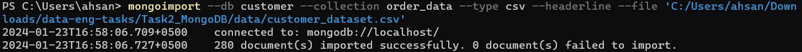

# Steps From Scratch - Task 2: MongoDB

All the steps taken since the start of Task 2 are documented here.

## Create Folder Structure

```markdown
Task2_MongoDB/
├── queries/
│   ├── subtask1_query.js
│   └── subtaskN_query.js
│
├── data/
│   └── customer_dataset.csv
│
├── documentation/
│   └── README.md
│   └── SETUP.md
```

- **Queries Subdirectory:** Folder to contain all MongoDB queries related to Task 2.
- **Data Subdirectory:** Folder to contain all data related to Task 2.
- **Documentation Subdirectory:** Folder to contain all docs related to Task 2.
- **README.md File:** File to document all steps taken to complete Task 2.
- **SETUP.md File:** File to document setup instructions for testers/contributors to Task 2.

## Import Customer Dataset to MongoDB

1. Open the `mongosh` shell.

2. Connect to your MongoDB server and use the following command to create `customer` database if it does not exist:
   ```js
   use customer
   ```

3. Create a collection named `order_data`:
   ```js
   db.createCollection('order_data') // creates 'order_data' collection
   ```

4. Import the `customer_dataset.csv` file using the following windows shell command:
   ```shell
   mongoimport --db customer --collection order_data --type csv --headerline --file 'C:/Users/ahsan/Downloads/data-eng-tasks/Task2_MongoDB/data/customer_dataset.csv'
   ```

   

5. Verify in mongosh that the data has been imported successfully:
   ```js
   db.order_data.find() // returns documents in this collection

   db.order_data.countDocuments() // returns 280 i.e the number of imported documents
   ```

## Sub-Task 1: Schema Design

### Schema 

```json
{
   "_id": ObjectId, 
   "customer_id": String,
   "customer_name": String,
   "order_id": Number,
   "order_date": ISODate,
   "shipment_date": ISODate,
   "product_id": String,
   "product_description": String,
   "quantity": Number,
   "unit_price": Number
}
```

### Explanation

- **_id:** MongoDB automatically adds this field as the primary key. It's an ObjectId and ensures the uniqueness of each document.

- **customer_id:** String type, representing the unique identifier for the customer.

- **customer_name:** String type, storing the name of the customer.

- **order_id:** Number type, representing the unique identifier for each order.

- **order_date:** ISODate type, storing the order date in the ISO date format.

- **shipment_date:** ISODate type, storing the shipment date in the ISO date format.

- **product_id:** String type, representing the unique identifier for the product.

- **product_description:** String type, providing a description of the product.

- **quantity:** Number type, indicating the quantity of the product ordered.

- **unit_price:** Number type, storing the unit price for a single quantity of the product.

### Considerations

- MongoDB uses BSON (Binary JSON) to store documents, and the data types align with BSON types.

- Using ObjectId as the primary key ensures unique identification of each document.

- ISODate is used to store date values in a standard format.

- Numeric fields (order_id, quantity, unit_price) are represented using the Number data type.

### Schema Validation

Schema validation can be enforced to keep some checks in our `order_data` collection's data. While collection creation, we can use this query to enforce validation:

```js
db.createCollection("order_data", {
   validator: {
      $jsonSchema: {
         bsonType: "object",
         required: ["customer_id", "customer_name", "order_id", "order_date", "shipment_date", "product_id",  "product_description", "quantity", "unit_price"],
         properties: {
            customer_id: {
               bsonType: "string",
               description: "Unique identifier for the customer - Required."
            },
            customer_name: {
               bsonType: "string",
               description: "Name of the customer - Required."
            },
            order_id: {
               bsonType: "int",
               description: "Unique identifier for the order - Required."
            },
            order_date: {
               bsonType: "date",
               description: "Date of the order - Required."
            },
            shipment_date: {
               bsonType: "date",
               description: "Date of shipment - Required."
            },
            product_id: {
               bsonType: "string",
               description: "Unique identifier for the product - Required."
            },
            product_description: {
               bsonType: "string",
               description: "Description of the product - Required."
            },
            quantity: {
               bsonType: "int",
               description: "Quantity of product ordered - Required."
            },
            unit_price: {
               bsonType: "number",
               description: "Unit price for a single quantity of product - Required."
            }
         }
      }
   }
})
```

This validator ensures that the required fields are present and have the correct data types.

## Sub-Task 2: Model Creation

The features and target variable for any model depends on the KPI (key performance indicators) most significant to our business objective. For example future orders can be predicted to get expected:

- Total revenue
- Number of orders
- Sales per product
- Orders per customer
- Delivery times

*<u>**Note:**</u> I assume that knowing the expected orders from each customer is more important for us right now. We can use this to <u>plan operational resources</u>, <u>do personalized marketing</u>, and <u>optimize delivery schedules</u>*
  
### Target Variable:
`future_order`: This would be a numerical variable representing the number of future orders from each customer in a time frame.

### Features:
***Basic:***
1. **Customer Information:**
   - `customer_id`: Unique identifier for the customer.
   - `customer_name`: Name of the customer.

2. **Order Information:**
   - `order_id`: Unique identifier for the order.
   - `order_date`: Date of the order.
   - `shipment_date`: Date of shipment.

3. **Product Information:**
   - `product_id`: Unique identifier for the product.
   - `product_description`: Description of the product.
   - `quantity`: Quantity of the product ordered.
   - `unit_price`: Unit price for a single quantity of the product.

***Derived:***
- **Time-based Features:**
  - Day of the week, month, quarter, and year from `order_date` and `shipment_date`.
  - Time duration between `order_date` and `shipment_date`.

- **Customer-based Features:**
  - Number of orders placed by the customer in the past.
  - Average quantity of every product in past orders.

- **Product-based Features:**
  - Frequency of ordering specific products.
  - Average quantity and unit price for each product.

### Data Set Considerations:
After analyzing the dataset, I see that:
- Each record represents a historical order with corresponding customer, order, and product information.
- Therefore, each row becomes a data point for training the model.
- The data is completely consistent and does not have any missing values.
- We can split the dataset into training and testing sets as there is ample data.

## Sub-Task 3: Data Updation

Updating `shipment_date` for a specified order id is straight forward. Find the document then update the `shipment_date` attribute. Sample query is given below, which you can run in mongosh when using `customers` database

```js
db.order_data.updateOne(
   { order_id: 1065 },  // sample order_id
   {
      $set: {
         shipment_date: ISODate("2014-01-31")  // sample shipment_date
      }
   }
)
```

